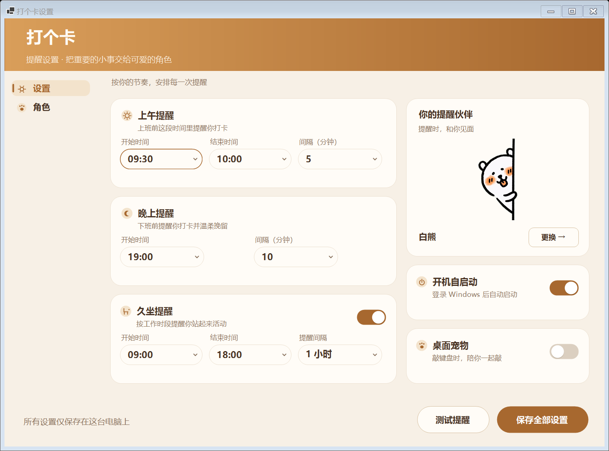
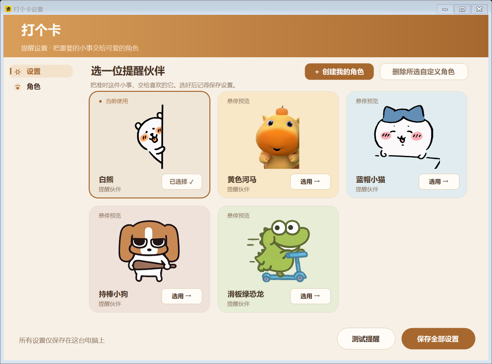
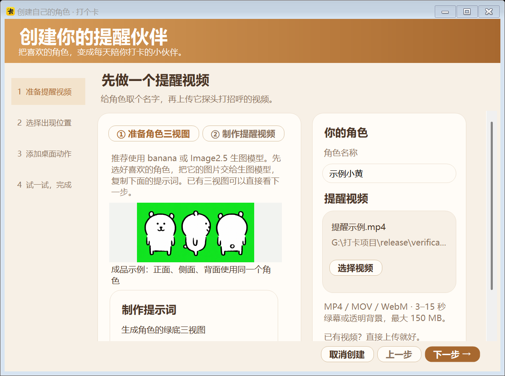

<div align="center">
  
  <h1>打个卡</h1>
  <p>
    <a href="https://github.com/dong-dong-yao/da-ge-ka/actions/workflows/build.yml"></a>
    <a href="https://github.com/dong-dong-yao/da-ge-ka/releases/latest"></a>
    <a href="https://github.com/dong-dong-yao/da-ge-ka/releases"></a>
    
    
    <a href="LICENSE"></a>
  </p>
  <p>
    <a href="https://github.com/dong-dong-yao/da-ge-ka/releases/latest"><strong>⬇️ 下载最新版</strong></a>
    ·
    <a href="CONTRIBUTING.md"><strong>🐾 一起共建</strong></a>
  </p>
</div>

由于作者总是忘记上下班打卡，于是，打个卡诞生了...

一个安静躺在 Windows 系统托盘的上下班打卡提醒工具。你喜欢的角色（可以自己设置）会从主屏幕四周随机探出并用气泡提醒你打卡了吗，不主动抢走正在输入的焦点；晚间确认以及关机、重启时会出现第二道确认。

## 功能

- 自定义角色：在角色页点击「＋ 创建角色」，按图文引导准备提醒视频与透明动作图；可以预览四个方向、键盘动作，并用点选和画笔修复鼠标跟随效果。

- 设置页采用紧凑双栏面板：上午、晚上、久坐时段并排调整时间与间隔，右侧显示提醒伙伴、开机启动与桌面宠物开关。默认窗口一屏可查看全部设置，较小窗口支持滚动；所有修改仍需点击「保存全部设置」生效。
- 设置卡片统一米白色；时间与间隔输入框固定为 34 逻辑像素高、最多 138 逻辑像素宽，随系统 DPI 等比缩放，不随表格空白拉伸。

- 角色页默认展示充分入场后的角色封面，自动裁去多余透明留白；悬停播放，移开恢复封面。画廊随窗口宽度切换为两列或三列，默认窗口可完整展示五个角色；选用后点击「保存全部设置」生效。

- 上班打卡前提醒：默认 `09:30–10:00`，每 5 分钟按固定时间节点提醒。（可根据实际上班时间修改）
- 下班打卡前提醒：默认从 `19:00` 开始，每 10 分钟按固定时间节点提醒。（可根据实际上班时间修改）
- 角色动画从允许的屏幕边缘随机出现，保持素材原始约 7.1 秒节奏，气泡提供“已打卡，闭嘴”按钮。白熊、黄色河马和蓝帽小猫支持上、下、左、右；持棒小狗和滑板绿恐龙只从左、右出现。
- 设置窗口采用左侧导航双页面：「设置」页可自由缩放，较小高度下可滚动访问全部内容；缩放或滚动时会暂缓角色预览并合并绘制，结束交互后自动恢复动画。「角色」页用网格卡片浏览全部角色，悬停卡片即可预览动画，确认后设置页同步显示当前角色。当前内置白熊、黄色河马、蓝帽小猫、持棒小狗和滑板绿恐龙，角色目录可继续扩展。
- 可选桌面宠物：开启后角色常驻桌面角落（默认右下角），透明置顶、鼠标穿透不挡操作。五个角色的鼠标手都会跟随指针并在点击时下压；白熊使用独立手臂图层，其余四个角色在用户提供的完整图片上做局部手臂形变，不带动身体和键盘。键盘方面，黄色河马与蓝帽小猫支持左、中、右三种姿势，持棒小狗与滑板绿恐龙使用左、右两种姿势（中区映射到右姿势）。短按也会显示，长按保持触键，松开后立即恢复待机图。托盘菜单勾选「允许鼠标拖动宠物（取消勾选可穿透）」后可以拖动换位，调整完取消勾选即可恢复鼠标穿透。默认关闭；在设置页打开开关后必须点击「保存设置」才会生效，也可从托盘菜单直接开启。
- 桌面宠物通过全局低级键盘和鼠标钩子获取瞬时输入状态。键盘事件仅在内存中瞬时读取 Windows virtual-key identity，只用于确定键盘手的位置；释放时立即清除该键的按下标记和次序，不保留已释放的键身份。通知时已映射的归一化目标坐标可短暂保留，用于一次可见的短按反馈，随后平滑回落。程序不会把键值转换为输入文字，也不会写入日志、保存、上传或传输。鼠标仅保留当前指针坐标、左右键按下状态及单次点击反馈位。程序本身不联网。
- 若安全软件拦截输入钩子安装，宠物会保留待机画面，托盘显示包含 Win32 错误码的不可点击状态，并在本次程序运行中弹出一次气泡提示；关闭后重新开启「桌面宠物」会重试安装，不影响其他提醒功能。若白熊原图已成功加载但动作切层失败，则保留透明静态原图并停止实时绘制。
- 晚间第二道确认显示“真的吗，那你为什么不走”，提供“真的 / 假的”两个选项；约 4.09 秒动画播完后从第一帧重新循环。
- 可配置打卡时间、提醒间隔、是否开机自启动和是否常驻桌面宠物。
- 可选久坐提醒，默认关闭；默认 `09:00–18:00`，可选每 `1 / 1.5 / 2 / 3` 小时提醒。久坐气泡没有按钮，只会自动消失。
- 打卡提醒优先；冲突时久坐提醒最多排队一次，未来提醒仍使用原固定时间节点。
- Windows 普通关机或重启时，在晚间尚未确认的情况下进行 best-effort 提醒。
- 单实例运行，不联网，不记录打卡历史。

## 界面预览

设置页（150% 系统缩放）：





创建自己的提醒伙伴：



## 一起把“打个卡”变得更可爱

打个卡已经有五个内置角色，也欢迎更多原创角色加入。

特别欢迎你一起参与：不会写代码也完全没关系。你可以画一个原创小角色，制作 GIF、视频或透明 PNG 动画，想一句更可爱的提醒文案，分享功能点子；也可以帮助改进代码、界面，或者在不同的 Windows 电脑上试用并反馈问题。

被项目采用的角色和素材，会在仓库中标注作者名字与个人主页。为了保护创作者和使用者，请只投稿自己的原创作品，或你明确拥有公开授权的素材；不要直接提交未经许可的动漫、游戏、影视或表情包角色。

- [查看参与贡献说明](CONTRIBUTING.md)
- [投稿一个新角色](https://github.com/dong-dong-yao/da-ge-ka/issues/new?template=character-submission.yml)
- [提出问题或新点子](https://github.com/dong-dong-yao/da-ge-ka/issues/new/choose)

## 系统要求

- Windows 10 或 Windows 11 x64
- 从源码构建需要 .NET 10 SDK

## 快速安装

1. 前往 [下载最新版](https://github.com/dong-dong-yao/da-ge-ka/releases/latest)，下载名称以 `DaGeKa-` 开头、以 `-win-x64.exe` 结尾的程序，放在固定目录；程序启动后显示的名称仍然是“打个卡”。升级前先从托盘退出旧版。
2. 双击启动；程序不会打开主窗口，而是驻留系统托盘。
3. 双击托盘图标，或右键选择“设置”，即可修改提醒参数。
4. 托盘右键选择“退出程序”可直接退出。

配置保存在 `%LOCALAPPDATA%\CheckInReminder\config.json`。配置目录沿用内部名称以兼容已有用户数据；旧配置会自动补上久坐提醒默认值和默认角色 `white-bear`。程序不会保存上午、晚上或久坐的完成状态与历史，重新启动后状态会重置。

### 桌面宠物人工验证

桌面宠物依赖 Windows 全局输入钩子、透明分层窗口和单实例机制，这些行为需要在目标 Windows 10 或 Windows 11 电脑上人工确认。验证新版本前，请按顺序执行：

1. 从托盘菜单退出正在运行的旧版「打个卡」，确认旧进程已经结束。
2. 启动新的 `打个卡.exe`，打开设置页，开启「桌面宠物」，然后点击「保存设置」。只切换开关而不保存不会应用设置。
3. 移动鼠标，确认鼠标侧手臂会跟随指针；分别按下鼠标左键和右键，确认点击动作可见。
4. 打开 Windows 记事本，分别短按和长按 Q、G、P，确认右手切换左、中、右三种触键姿势，肩部不随下压移动，松开后回弹并恢复原待机抬手，同时记事本输入不受影响。
5. 在托盘菜单勾选「允许鼠标拖动宠物（取消勾选可穿透）」，确认可以拖动宠物换位；取消勾选后，确认鼠标能够点击宠物后方的窗口。
6. 若托盘显示「输入监听不可用（错误 …）」并出现一次气泡提示，检查安全软件是否拦截了全局钩子；关闭后重新开启「桌面宠物」以重试。原图加载成功但动作切层失败时也会保留静态画面。提醒、设置和托盘仍可使用。

当前正式版本为 **v1.2.0**，包含软件内创建角色、素材教程、鼠标修复与使用声明。请从 [正式版下载页](https://github.com/dong-dong-yao/da-ge-ka/releases/latest) 获取 EXE；页面中的 Source code 压缩包面向开发者。

## 从源码构建

> `global.json` 锁定 .NET SDK 10.0.400。已安装该 SDK 的电脑直接使用下列命令；本机使用 `.\.dotnet\dotnet.exe`，当前工作树的 `.dotnet` 链接指向主仓库 SDK。

```powershell
dotnet restore .\CheckInReminder.slnx
dotnet test .\CheckInReminder.slnx -c Release
dotnet build .\CheckInReminder.slnx -c Release
dotnet publish .\CheckInReminder\CheckInReminder.csproj `
  -c Release `
  -r win-x64 `
  --self-contained true `
  -p:PublishSingleFile=true `
  -p:IncludeNativeLibrariesForSelfExtract=true `
  -p:PublishTrimmed=false `
  -p:DebugType=None `
  -p:DebugSymbols=false
```

不要开启 trimming。WinForms 与本项目使用的运行时能力不适合在没有专项验证的情况下裁剪。

## 项目结构

- `CheckInReminder/`：WinForms 程序、提醒调度、设置持久化、系统托盘和视觉资源。
- `CheckInReminder.Tests/`：时间节点、窗口边界和视觉主题契约测试。
- `tools/convert_green_screen.py`：开发期将绿幕 MP4 转为软边透明 PNG 序列；运行提醒不依赖该脚本。v1.2 创建器使用随程序打包的视频组件离线导入素材。
- `tools/SettingsUiProbe/`：独立进程的真实 DPI 尺寸与渲染检查，避免同一测试进程的 DPI 缓存造成误判。
- `VERIFICATION.md`：自动化验证结果与仍需人工检查的 Windows 行为。

## 添加一个新角色

### 在软件里创建（v1.2.0）

角色页点击「＋ 创建角色」，按四步完成：名称与提醒动画 → 出现方式 → 桌面互动（选填）→ 试用并保存。创建后可立即选用，回到设置点击「保存全部设置」生效。角色包保存在 `%LOCALAPPDATA%\CheckInReminder\characters\user-{id}`，独立于程序文件，原始素材移动或程序更新不会影响已创建角色。

- 提醒视频：本机 MP4 / MOV / WebM，3–15 秒，单文件不超过 150 MB，最长边不超过 4096 像素。导入为 12 fps、最长边 520 的透明 PNG 序列，整段统一裁切；音轨忽略。透明 WebM 的透明信息通过对应解码器保留。
- 视频背景：自动保留透明背景或识别明显绿幕/蓝幕，无需选择处理方式。复杂背景不自动抠人，绿色角色应使用蓝幕或透明素材。
- 方向：至少启用一个，声明原素材出现方向；可选独立方向视频。未提供时使用现有翻转/旋转规则，预览确认后再启用。
- 桌宠：按引导上传抬手、按左、按中、按右四张完整透明 PNG，画布尺寸、身体、鼠标和键盘的位置必须一致。检查真实透明度，拒绝不透明白底图；图片保持比例放入 600×448 画布，不做背景抠除。
- 鼠标互动：先尝试参考模板；效果不准确时，在最后一步点击“手动修复鼠标模块”。先点鼠标、再点手臂进行选取；用“涂上漏掉的／擦掉多选的”修边，按住涂抹时自动出现 3× 放大镜。漏掉黑色轮廓可点“补选黑色边缘”；连接处、鼠标中心、鼠标垫点选等工具直接展示。每张图自动预判纯灰鼠标垫，也可点击灰色区域重新选择；保留备用圈垫。右侧自动试动；四个姿势逐一确认后应用。创建时保存原图、静态底图、移动层和校准，运行时直接变形。纯灰鼠标垫用多点取色补齐，小幅移动；复杂花纹背景不支持。模板未匹配时明确提示，调整前只有键盘动作。也可主动选择仅键盘互动。旧版分层角色包仍可读取。
- 不传桌宠素材时仅提供提醒；开启全局桌宠开关也不会显示其他角色占位。第二道确认动画和提醒文案沿用原版本。
- 创建预览支持方向播放、键盘按钮及预览区域鼠标移动/点击。取消或失败不会留下半成品角色。损坏角色包会跳过并在画廊提示；角色丢失时仅回退角色，不重置提醒时间。
- 可删除所选自定义角色（会要求确认），内置角色不能删除。创建与删除操作立即保存角色内容；选用仍遵循保存设置流程。

程序不调用 AI，不上传素材。视频处理组件随正式发布版提供，第一次使用解压到 `%LOCALAPPDATA%\CheckInReminder\media-tools`；不要求用户安装命令行工具。创建器内嵌三视图、提醒视频、抬手图和按键图的分步图文教程，可复制提示词并复制或保存原始动作参考图；已有素材可折叠教程直接上传。

### 开发者打包视频组件

源码不提交约 68 MB 的视频组件 ZIP。准备完整 Windows x64 FFmpeg shared 构建，`bin` 的上级目录需有构建随附 `LICENSE.txt`，运行：

```powershell
.\tools\pack-media-tools.ps1 -FFmpegDirectory '你的组件目录\bin'
.\.dotnet\dotnet.exe test .\CheckInReminder.slnx -c Release
.\.dotnet\dotnet.exe publish .\CheckInReminder\CheckInReminder.csproj -c Release -r win-x64 --self-contained true -p:PublishSingleFile=true -p:PublishTrimmed=false
```

无组件时普通源码构建仍可进行，媒体集成测试会明确跳过，创建器显示组件缺失说明；完整发布命令会拒绝缺组件构建。GitHub Actions 目前只运行测试与构建，不自动发布完整程序。正式 Release 的 EXE 包含完整组件，使用者无需另外下载 ZIP。Release 另附媒体组件 ZIP 供开发者复现构建，将其保存为 `CheckInReminder/Assets/MediaTools/tools.zip` 即可。组件源码、构建信息与许可入口见 [使用声明与第三方许可](THIRD_PARTY_NOTICES.md)。

### 开发者注册内置角色

1. 用 `tools/convert_green_screen.py` 把角色的绿幕 MP4 转成透明 PNG 序列。
2. 在 `CheckInReminder/Assets/Animations/` 下新建以角色 Id（kebab-case，如 `shiba`）命名的目录，帧文件按 `frame_0000.png` 起的四位序号命名，把序列放进去（csproj 已按通配符嵌入，无需改动工程文件）。
3. （可选）完整桌宠姿势图放入 `CheckInReminder/Assets/DesktopPet/Characters/{角色Id}/`：必须包含 `idle.png`（也可用 JPG）、`press-left.png` 和 `press-right.png`，可选 `press-center.png`。只有左右两张按键图时，中区自动映射到右图。旧式逐帧素材仍可使用 `{角色Id}-pet-idle/` 与 `{角色Id}-pet-tap/`；两种素材都没有时自动降级为占位显示。

4. 在 `CheckInReminder/AnimationCatalog.cs` 的 `BuildCharacters()` 里注册一行：`new("shiba", "柴犬", "shiba", TimeSpan.FromSeconds(时长), false)`。`SourceEdge` 要填写原视频实际从哪条边出现（默认右侧）；若角色只能从左右出现，再设置 `AllowedEdges = [ScreenEdge.Left, ScreenEdge.Right]`。
5. 运行 `dotnet test`（用本地 SDK `.\.dotnet\dotnet.exe`）：目录规范、资源完整性和默认角色断言会校验新角色是否接好。

四个现有完整姿势角色的鼠标联动复用白熊的肩部固定网格变形：原图手臂、手掌和鼠标进入同一个移动层，静态层不绘制第二只鼠标或手臂底色；待机和运动使用同一套合成。轮廓按每张姿势图提取，灰色鼠标垫边缘从移动层排除。这里的范围、颜色阈值和肩部位置只针对当前素材模板，新模板不能直接照搬坐标，需重新校准并检查所有按键姿势。

鼠标回归检查：运行 `DesktopPetControllerTests` 中的 `SpritePets_` 测试；设置环境变量 `PET_RIG_PROBE_DIR` 后，测试会额外导出分层图与四角色的鼠标极限位置、点击、键盘姿势组合图，便于人工审查。检查重点是静态背景没有旧手或鼠标轮廓、肩部连接、鼠标随手移动，以及鼠标垫外缘和键盘不随鼠标移动。自动测试不能代替实际桌面交互验收。

桌沿同样属于静态环境：从每张姿势图未遮挡的左段测量斜率、位置和线宽，补齐手臂下方的桌沿，并把手臂轮廓之外的桌沿像素从移动层移回背景。`SpritePets_DeskLineStaysContinuousWhenArmMovesAway` 检查手臂移开后桌沿仍沿原方向连续。河马与恐龙的 `press-right.png` 原图没有左段桌沿，保持缺省，不凭空添加。
## 已知边界

- Windows 的普通 shutdown/restart 参数无法可靠区分关机和重启，因此晚间未完成时两者使用相同提醒流程。
- Windows 仍可能显示自己的 shutdown blocker 界面，用户也可以选择强制结束程序。
- 物理断电、长按电源键和任务管理器强制结束不在处理范围内。
- 当前不处理跨午夜状态。
- 当前只按主屏幕工作区定位，不专门适配多显示器和全屏应用。
- 自编译程序没有代码签名，可能触发 SmartScreen、Defender 或企业安全策略。
- 不要使用自动化脚本触发真实关机或重启测试。

Win32 行为参考：

- [WM_QUERYENDSESSION](https://learn.microsoft.com/windows/win32/shutdown/wm-queryendsession)
- [ShutdownBlockReasonCreate](https://learn.microsoft.com/windows/win32/api/winuser/nf-winuser-shutdownblockreasoncreate)
- [ShutdownBlockReasonDestroy](https://learn.microsoft.com/windows/win32/api/winuser/nf-winuser-shutdownblockreasondestroy)
- [Windows Vista 之后的关机行为](https://learn.microsoft.com/windows/win32/shutdown/shutdown-changes-for-windows-vista)

## 验证状态

自动化测试覆盖时间计算、窗口布局、角色预览、桌宠渲染及设置保存。托盘交互、NoActivate 焦点行为、开机启动、睡眠恢复和关机拦截必须在真实 Windows 环境人工验证，具体清单见 [VERIFICATION.md](VERIFICATION.md)。

## 许可证

程序代码使用 [MIT License](LICENSE)。角色、美术和动画素材可能使用各自单独标注的授权；仓库中由外部素材转换而来的角色动画不因 MIT 许可证而改变其原有权利归属，再次公开分发或商用前应自行确认素材授权。

[使用声明、免责声明与第三方许可](THIRD_PARTY_NOTICES.md)已嵌入单文件 EXE，可从托盘菜单「使用声明与许可」查看。项目免费提供；角色及示例素材的权利归各自合法权利人，代码的 MIT 许可不授予这些素材的使用权。用户导入素材应具有相应授权，权利问题可通过 GitHub Issue 联系核查。声明不排除法律规定不得排除的责任。
